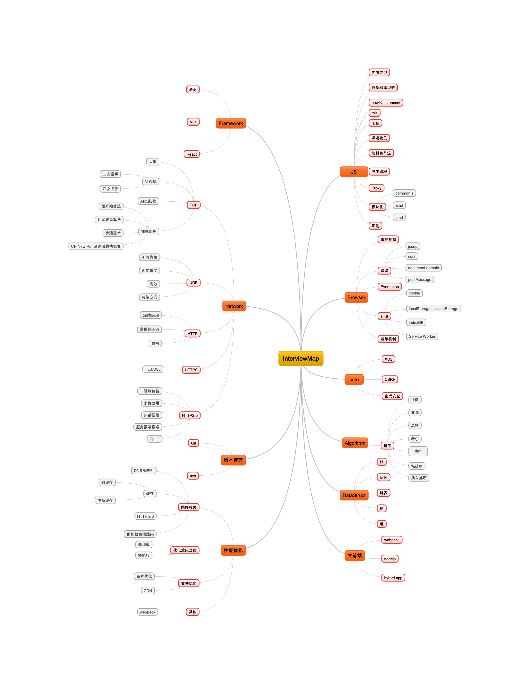
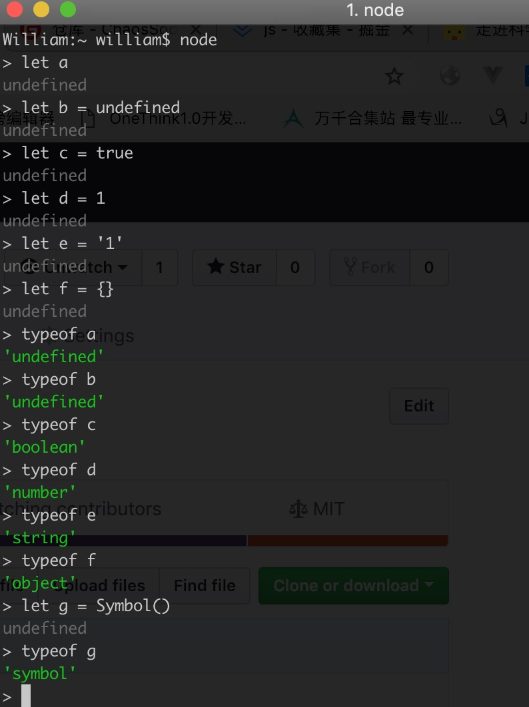

## 前端之路

    众所周知，前端发展如火如荼，日新月异，而且很长一段时间内都将如此。此项目记录自己的前端进阶之路，如有差错，请指出。
    以下技能图是使用 [MindMaple Lite](https://mindmaple-lite.en.softonic.com/) 画的，相关知识点持续添加


## Js篇
###类型
	基本类型：```String, Number, Boolean, Null, Symbol```
	引用类型： ```Object```
	
	ps: 基本类型存在栈中，引用类型存在堆中
	typeof操作符：


可以使用typeof来判断数据类型
值得留意的是：```typeof null ->'object'
					 typeof NaN ->'number'
					 typeof [] -> 'object'
					 ```
判断数组的方法：
let a = []

1. a instanceof Array //true
2. a.constructor==Array //true
3. Array.isArray(a) //true 需要浏览器支持
4. 改造3的方法：

```
if(!Array.isArray){
	Array.isArray = function(arg){
  		return Object.prototype.toString.call(arg) === '[object Array]';
  };
}
```

谈到变量，就不得不说一下定义变量的关键字：`var`,`let`,`const`

var: 全局作用域，变量提升

let: 块级作用域

const: 常量

使用规则: 能用const则用const，需要改变值，则用let，不到万不得已再使用var

ps: const常量，值不能改变
	eg: ```const obj = {}
	
			 obj['a'] = 'a' //obj={a:'a'}
			 
			 obj = 'a' //报错
		 ```	
		 	 
###原型和原型链
参考
[JS原型、原型链深入理解](https://www.cnblogs.com/wyaocn/p/5815761.html)
## 浏览器相关
pass
## 安全
pass
## 算法
pass
## 数据结构
pass
## 性能
pass
## 网络相关
pass
## 版本管理
pass
## 框架
pass
## 大前端
pass
## 手写代码
在面试前端开发中，原生JavaScript能力的高低是占比很大的一个体现部分，不少考官会有要求现场写一些JS方法，以下整理了一些前端面试的各种方法，希望能帮到你。

1. promise的实现

```
//Promise 的三种状态  (满足要求 -> Promise的状态)
const PENDING = 'pending'
const FULFILLED = 'fulfilled'
const REJECTED = 'rejected'

class IPromise {
  constructor(fn) {
    //当前状态
    this.state = PENDING
    //终值
    this.value = null
    //拒因
    this.reason = null
    //成功态回调队列
    this.onFulfilledCallbacks = []
    //拒绝态回调队列
    this.onRejectedCallbacks = []

    //成功态回调
    const resolve = value => {
      // 使用macro-task机制(setTimeout),确保onFulfilled异步执行,且在 then 方法被调用的那一轮事件循环之后的新执行栈中执行。
      setTimeout(() => {
        if (this.state === PENDING) {
          // pending(等待态)迁移至 fulfilled(执行态),保证调用次数不超过一次。
          this.state = FULFILLED
          // 终值
          this.value = value
          this.onFulfilledCallbacks.map(cb => {
            this.value = cb(this.value)
          })
        }
      })
    }
    //拒绝态回调
    const reject = reason => {
      // 使用macro-task机制(setTimeout),确保onRejected异步执行,且在 then 方法被调用的那一轮事件循环之后的新执行栈中执行。 (满足要求 -> 调用时机)
      setTimeout(() => {
        if (this.state === PENDING) {
          // pending(等待态)迁移至 fulfilled(拒绝态),保证调用次数不超过一次。
          this.state = REJECTED
          //拒因
          this.reason = reason
          this.onRejectedCallbacks.map(cb => {
            this.reason = cb(this.reason)
          })
        }
      })
    }
    try {
      //执行promise
      fn(resolve, reject)
    } catch (e) {
      reject(e)
    }
  }
  then(onFulfilled) {
    typeof onFulfilled === 'function' &&
      this.onFulfilledCallbacks.push(onFulfilled)
    // 返回this支持then 方法可以被同一个 promise 调用多次
    return this
  }
  catch(onRejected) {
    typeof onRejected === 'function' &&
      this.onRejectedCallbacks.push(onRejected)
  }
}
let pp = new IPromise((resolve, reject) => {
  console.log(resolve)
  reject('reject')
})
pp.then(value => {
  console.log('value')
  console.log(value)
}).catch(reason => {
  console.log('reason')
  console.log(reason)
})

```
2. bind的实现

```
Function.prototype.mybind = function () {
    var self = this,args = arguments;
    return function () {
        self.apply(args);
    }

}

```
3. 函数防抖

```
// func是用户传入需要防抖的函数
// wait是等待时间
const debounce = (func, wait = 50) => {
  // 缓存一个定时器id
  let timer = 0
  // 这里返回的函数是每次用户实际调用的防抖函数
  // 如果已经设定过定时器了就清空上一次的定时器
  // 开始一个新的定时器，延迟执行用户传入的方法
  return function(...args) {
    if (timer) clearTimeout(timer)
    timer = setTimeout(() => {
      func.apply(this, args)
    }, wait)
  }
}

```
4. 函数节流

```
function throttle(method,delay){
    var timer=null;
    return function(){
        var context=this, args=arguments;
        if(timer) return;
        timer=setTimeout(function(){
            method.apply(context,args);
            timer = null;
        },delay);
    }
}

```
5. 深拷贝

```
function deepClone(obj) {
    let result = typeof  obj.splice === "function" ? [] : {};
    if (obj && typeof obj === 'object') {
        for (let key in obj) {
            if (obj[key] && typeof obj[key] === 'object') {
                result[key] = deepClone(obj[key]);//如果对象的属性值为object的时候，递归调用deepClone。
            } else {
                result[key] = obj[key];//如果对象的属性值不为object的时候，直接复制参数对象的每一个键值到新的对象对应的键值对中。
            }

        }
        return result;
    }
    return obj;
}

```
6. 单例模式

```
function A(name){
    // 如果已存在对应的实例
   if(typeof A.instance === 'object'){
       return A.instance
   }
   //否则正常创建实例
   this.name = name
   
   // 缓存
   A.instance =this
   return this
}

```
7. 发布订阅模式

```
	  // 事件类
    class EventEmitter {
        constructor () {
            this.events = { } // 事件队列，保存着每一种事件的处理程序
        }
 
        on (type, callback) { // type 要绑定的事件名字， callback 处理程序
            if (this.events[type]) {// 如果事件队列中有这个事件
                // 将此次绑定的处理程序放入进去
                this.events[type].push(callback.bind(this))
                return false
            }
            // 如果没有这个事件，新建
            this.events[type] = [callback.bind(this)]
        }
 
        emit (type, ...args) {
            // 触发事件的时候如果没有事件，报错
            if (!this.events[type]) {
                console.error('type event is not found')
            }else {
                // 挨个执行队列中的处理程序
                this.events[type].forEach(callback => {
                    callback(...args)
                });
            }
        }
    }
 
    let bus = new EventEmitter()
 
    bus.on('play', (num1, num2) => {
        alert(456)
        alert(num1 + num2)
    })
    
    bus.emit('play', 1, 2)
```
8. new的实现

```
function create() {
    // 创建一个空的对象
    let obj = new Object()
    // 获得构造函数
    let Con = [].shift.call(arguments)
    // 链接到原型
    obj.__proto__ = Con.prototype
    // 绑定 this，执行构造函数
    let result = Con.apply(obj, arguments)
    // 确保 new 出来的是个对象
    return typeof result === 'object' ? result : obj
}

```
9. 闭包：访问函数内部变量的函数
```
function A() {    
	var count = 0;    
	function B() {       
		count ++;       
		console.log(count);    
	}    
	return B;
}
var C = A();
C();// 1
C();// 2
C();// 3
```
10. 冒泡排序
```
function bubbleSort(arr) {
    let len = arr.length;
    for (var i = 0; i < len; i++) {
        for (var j = 0; j < len - 1 - i; j++) {
            if (arr[j] > arr[j+1]) {        //相邻元素两两对比
                [arr[j], arr[j+1]] = [arr[j+1], arr[j]];        //元素交换
            }
        }
    }
    return arr;
}
```
11. 快排
```
function quickSort(arr){
    //如果数组<=1,则直接返回
    if(arr.length <= 1) { return arr; }
    var pivotIndex = Math.floor(arr.length/2);
    //找基准，并把基准从原数组删除
    var pivot=arr.splice(pivotIndex, 1)[0];
    //定义左右数组
    var left=[];
    var right=[];
    //比基准小的放在left，比基准大的放在right
    for(var i=0; i<arr.length; i++){
	    if(arr[i]<=pivot){
	          left.push(arr[i]);
	    }else{
	          right.push(arr[i]);
	    }
    }
    //递归
    return quickSort(left).concat([pivot],quickSort(right));
}
```
12. 数组去重
```
let arr = [1,1,2,3,4,4,4]
let result1 = arr.filter((val, key, self) => self.indexOf(val) === key)

let result2 = [...new Set(arr)]

let result2 = Array.from(new Set(arr))
```


